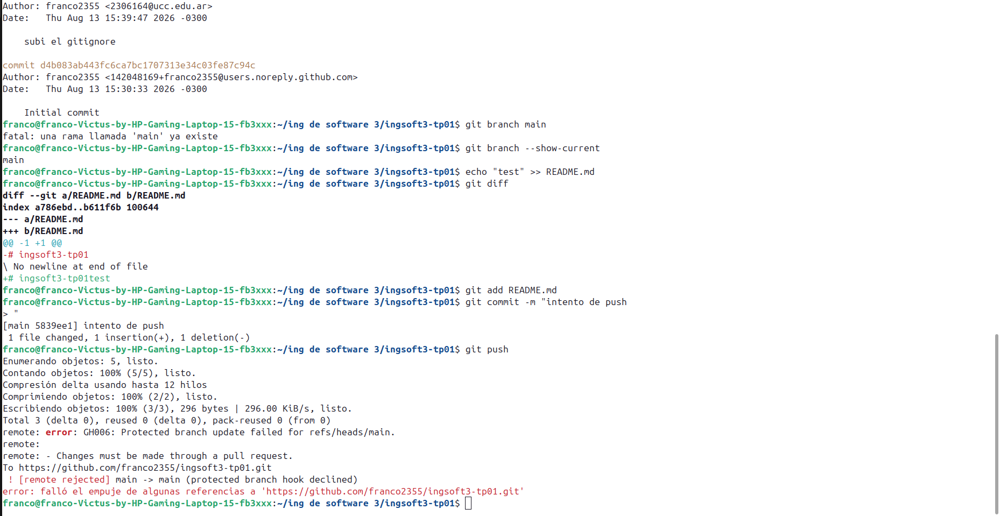
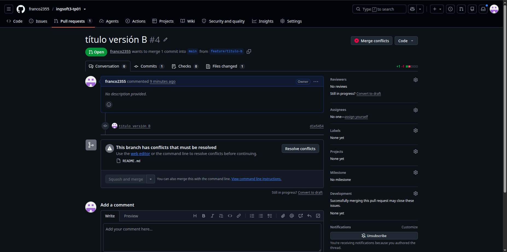
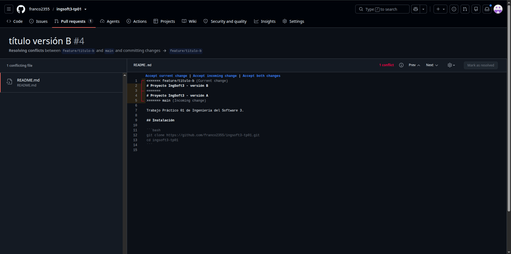
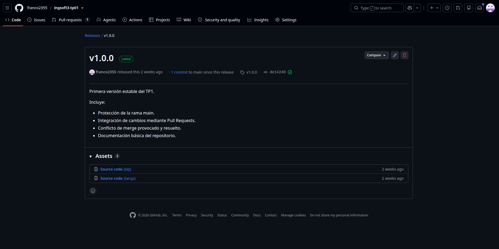
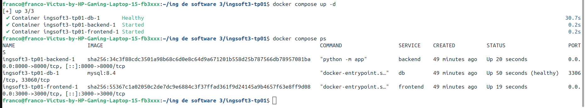
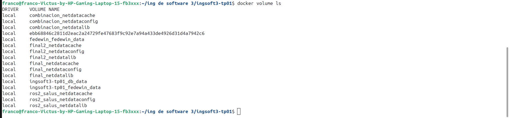
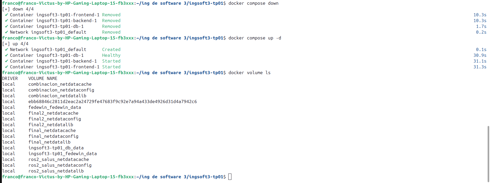
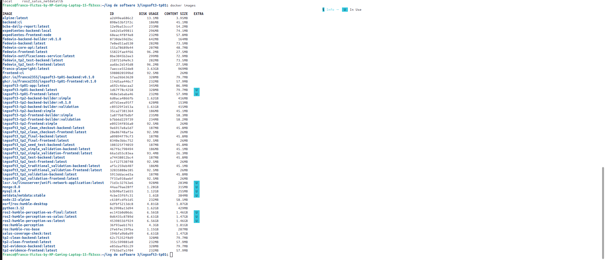
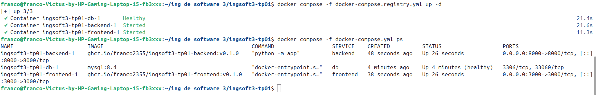

# Evidencias — TP1

## 1. Push directo a `main` rechazado

GitHub rechazó el push porque `main` está protegida y los cambios deben entrar mediante un Pull Request.

## 2. Conflicto detectado en el Pull Request

El PR #4 quedó en conflicto después de mergear la versión A, porque las dos ramas cambiaron la misma línea.

PR: <https://github.com/franco2355/ingsoft3-tp01/pull/4>

## 3. Marcadores del conflicto

GitHub mostró los marcadores del conflicto entre las versiones A y B. Elegí conservar la versión B.

## 4. Release `v1.0.0` publicada

La primera versión estable quedó publicada con el tag `v1.0.0`.

Release: <https://github.com/franco2355/ingsoft3-tp01/releases/tag/v1.0.0>

## Evidencias del TP2

### 1. Sistema ejecutándose con Docker Compose

Se observa la aplicación iniciada con `docker compose up -d`. Los servicios
`frontend`, `backend` y `db` están activos, y MySQL aparece como saludable.

### 2. Persistencia de los datos

#### Volumen actual

Antes de detener los contenedores se encuentra el volumen
`ingsoft3-tp01_db_data`, donde MySQL guarda sus datos.

#### Volumen después de `down` y `up`

Después de ejecutar `docker compose down` y `docker compose up -d`, el mismo
volumen continúa disponible. Esto demuestra que los datos no dependen de la
vida de los contenedores.

### 3. Comparación del tamaño de las imágenes

La captura compara las imágenes finales del backend y frontend con
`python:3.12` y `node:22-alpine`, utilizadas durante la construcción.

### 4. Imágenes publicadas en el registry

El proyecto se inicia mediante `docker-compose.registry.yml`. En la columna
`IMAGE` se observan las imágenes públicas del backend y frontend con el tag
`v0.1.0`.

- [Paquete backend](https://github.com/users/franco2355/packages/container/package/ingsoft3-tp01-backend)
- [Paquete frontend](https://github.com/users/franco2355/packages/container/package/ingsoft3-tp01-frontend)
